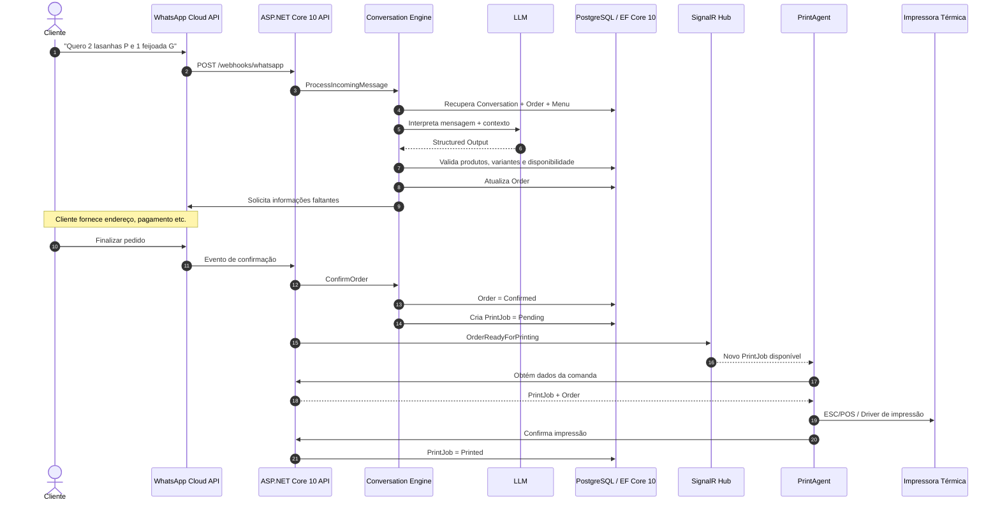

# WhatsApp Order Automation Engine

[](https://dotnet.microsoft.com/)
[](https://dotnet.microsoft.com/apps/aspnet)
[](https://blog.cleancoder.com/uncle-bob/2012/08/13/the-clean-architecture.html)
[](https://openai.com/)
[](https://www.postgresql.org/)
[](https://developers.facebook.com/docs/whatsapp/)

SaaS multi-tenant para **automação conversacional de pedidos de restaurantes e marmitarias via WhatsApp**.

O sistema recebe as mensagens dos clientes através da **WhatsApp Business Cloud API**, apresenta o cardápio vigente, interpreta pedidos escritos em linguagem natural, coleta automaticamente as informações necessárias para a entrega, valida os produtos contra o cardápio do restaurante e conduz o cliente até a confirmação do pedido.

Após a finalização, o pedido é persistido e disponibilizado automaticamente para um **PrintAgent local**, responsável pela impressão da comanda em uma impressora térmica instalada no estabelecimento.

O objetivo é reduzir ao mínimo a intervenção humana durante o atendimento inicial, permitindo que a equipe do restaurante concentre seus esforços na **preparação e entrega dos pedidos**.

---

## 🎯 Problema

Restaurantes de bairro e marmitarias frequentemente recebem diversos pedidos simultaneamente pelo WhatsApp.

Em horários de pico, isso pode resultar em:

* demora para responder clientes;
* clientes sem atendimento;
* erros na transcrição dos pedidos;
* repetição constante das mesmas perguntas;
* necessidade de copiar manualmente pedidos para comandas;
* perda de vendas;
* sobrecarga da equipe.

O **WhatsApp Order Automation Engine** automatiza esse fluxo desde a primeira mensagem até a geração da comanda.

---

## 🔄 Fluxo Principal

```text
Cliente envia mensagem
        ↓
Sistema identifica o restaurante e a conversa
        ↓
Envia saudação + cardápio do dia
        ↓
Cliente escreve seu pedido naturalmente
        ↓
IA interpreta produtos, quantidades e tamanhos
        ↓
Backend valida os dados contra o cardápio
        ↓
Sistema identifica informações ausentes
        ↓
Pergunta somente o necessário:
 ├── bebida
 ├── endereço
 ├── forma de pagamento
 └── troco, quando necessário
        ↓
Sistema calcula e apresenta o resumo
        ↓
Cliente confirma
        ↓
Pedido é finalizado
        ↓
PrintJob é criado
        ↓
PrintAgent recebe a notificação
        ↓
Comanda é impressa
        ↓
Equipe prepara o pedido
```

---

## 💬 Exemplo de Atendimento

```text
Cliente:
Boa tarde!

Bot:
Boa tarde! Tudo bem? 👋

Segue nosso cardápio de hoje:

[Imagem do cardápio]

Fique à vontade para fazer seu pedido.
```

O cliente pode escrever naturalmente:

```text
Quero duas lasanhas pequenas
e uma feijoada grande
```

A mensagem é interpretada internamente como:

```json
{
  "items": [
    {
      "product": "Lasanha Bolonhesa",
      "variant": "P",
      "quantity": 2
    },
    {
      "product": "Feijoada Completa",
      "variant": "G",
      "quantity": 1
    }
  ]
}
```

Após validar os produtos:

```text
Bot:
Entendi 👍

2x Lasanha P
1x Feijoada G

Gostaria de alguma bebida?
```

O cliente continua:

```text
Uma Coca 2L.
Meu endereço é Rua Exemplo, 123.
Vou pagar no cartão.
```

Como endereço e pagamento já foram informados, o sistema **não pergunta novamente**.

Ao final:

```text
Confira seu pedido:

2x Lasanha P ........ R$ 40,00
1x Feijoada G ....... R$ 60,00
1x Coca-Cola 2L ..... R$ 18,00

Subtotal ............ R$ 118,00
Taxa de entrega ..... R$  0,00
Total ............... R$ 118,00

Entrega:
Rua Exemplo, 123

Pagamento:
Cartão

[ Finalizar pedido ]
[ Alterar pedido ]
```

Após a confirmação, o pedido é persistido e enviado para impressão.

---

# 📐 Arquitetura

O projeto utiliza os princípios da **Clean Architecture**, mantendo as regras de negócio independentes de banco de dados, WhatsApp, inteligência artificial e hardware de impressão.

```text
                         ┌─────────────────────┐
                         │       Domain        │
                         │                     │
                         │ Orders              │
                         │ Products            │
                         │ Menus               │
                         │ Conversations       │
                         │ Restaurants         │
                         └─────────▲───────────┘
                                   │
                         ┌─────────┴───────────┐
                         │     Application     │
                         │                     │
                         │ Use Cases           │
                         │ Ports / Interfaces  │
                         │ Orchestration       │
                         └──────▲────────▲─────┘
                                │        │
                ┌───────────────┘        └───────────────┐
                │                                        │
       ┌────────┴─────────┐                    ┌─────────┴────────┐
       │ Infrastructure   │                    │       API        │
       │                  │                    │                  │
       │ EF Core          │                    │ Webhooks         │
       │ PostgreSQL       │                    │ REST API         │
       │ OpenAI           │                    │ SignalR Hub      │
       │ WhatsApp         │                    │ Authentication   │
       └──────────────────┘                    └──────────────────┘
                                                        │
                                                        │ SignalR
                                                        ▼
                                                ┌───────────────┐
                                                │  PrintAgent   │
                                                │     .NET      │
                                                └───────┬───────┘
                                                        │
                                                        ▼
                                                Impressora térmica
```

---

## 🧱 Estrutura da Solution

```text
WhatsAppOrderAutomation.sln

src/
│
├── WhatsAppOrderAutomation.Domain/
│
├── WhatsAppOrderAutomation.Application/
│
├── WhatsAppOrderAutomation.Infrastructure/
│
├── WhatsAppOrderAutomation.Api/
│
└── WhatsAppOrderAutomation.PrintAgent/
│
└── tests/
    │
    ├── WhatsAppOrderAutomation.Domain.Tests/
    ├── WhatsAppOrderAutomation.Application.Tests/
    └── WhatsAppOrderAutomation.IntegrationTests/
```

Todos os projetos utilizam:

```text
Target Framework: net10.0
Language: C# 14
```

---

# 🧩 Domain

O `Domain` contém as regras centrais do negócio e não possui dependência de:

* Meta;
* WhatsApp;
* OpenAI;
* PostgreSQL;
* Entity Framework Core;
* SignalR;
* impressoras.

Estrutura inicial:

```text
Domain/
│
├── Restaurants/
│   ├── Restaurant.cs
│   └── RestaurantSettings.cs
│
├── Catalog/
│   ├── Product.cs
│   ├── ProductVariant.cs
│   ├── Menu.cs
│   └── MenuItem.cs
│
├── Customers/
│   └── Customer.cs
│
├── Conversations/
│   ├── Conversation.cs
│   └── ConversationState.cs
│
├── Orders/
│   ├── Order.cs
│   ├── OrderItem.cs
│   ├── OrderStatus.cs
│   └── PaymentMethod.cs
│
├── Printing/
│   ├── PrintJob.cs
│   └── PrintJobStatus.cs
│
└── Common/
    ├── Entity.cs
    ├── AggregateRoot.cs
    └── ValueObjects/
        └── Address.cs
```

---

# 🍽️ Catálogo e Cardápio

O sistema diferencia o **catálogo do restaurante** do **cardápio vigente**.

Um produto pode existir no restaurante sem necessariamente estar disponível naquele dia.

Exemplo:

```text
Produto
└── Lasanha Bolonhesa
    ├── P → R$ 20,00
    ├── M → R$ 25,00
    └── G → R$ 30,00
```

Bebidas seguem a mesma estrutura:

```text
Coca-Cola
├── Lata  → R$ 7,00
├── 600ml → R$ 10,00
└── 2L    → R$ 18,00
```

O cardápio diário determina quais produtos estão efetivamente disponíveis.

```text
Menu
├── Date
├── ImageUrl
└── Items
```

Dessa forma, a imagem tradicional do cardápio continua sendo enviada pelo WhatsApp, enquanto o backend possui dados estruturados para validação dos pedidos.

---

# 🛒 Pedido

O pedido é um dos principais agregados do domínio.

```text
Order
├── Restaurant
├── Customer
│
├── Items
│   ├── Product
│   ├── Variant
│   ├── Quantity
│   └── UnitPrice
│
├── DeliveryAddress
├── PaymentMethod
├── ChangeFor
├── DeliveryFee
├── Status
├── CreatedAt
└── ConfirmedAt
```

Os itens armazenam um **snapshot do preço e descrição no momento da compra**.

Assim, alterações futuras no catálogo não modificam pedidos históricos.

---

## Estados do Pedido

```text
Draft
  ↓
AwaitingConfirmation
  ↓
Confirmed
```

Fluxos alternativos:

```text
Draft
  ↓
Cancelled
```

Estados iniciais:

```csharp
public enum OrderStatus
{
    Draft = 1,
    AwaitingConfirmation = 2,
    Confirmed = 3,
    Cancelled = 4
}
```

---

# 💬 Conversation Engine

Cada cliente possui sua própria conversa ativa.

Isso permite que dezenas de clientes sejam atendidos simultaneamente sem compartilhar estado.

```text
Cliente A → Conversation A → Order A
Cliente B → Conversation B → Order B
Cliente C → Conversation C → Order C
```

Estados iniciais:

```csharp
public enum ConversationState
{
    Started = 1,
    WaitingForOrder = 2,
    CollectingInformation = 3,
    WaitingForConfirmation = 4,
    Completed = 5
}
```

O Conversation Engine é responsável por determinar:

* o estado atual da conversa;
* qual pedido está sendo montado;
* quais informações já foram fornecidas;
* quais informações ainda estão ausentes;
* qual deve ser a próxima resposta.

O sistema deve perguntar **somente aquilo que ainda estiver faltando**.

---

# 🤖 Inteligência Artificial

A IA é utilizada como uma camada de **interpretação de linguagem natural**.

Ela não representa a fonte da verdade do sistema.

```text
Cliente
   ↓
"duas feijuca grande e uma coca 2 litros"
   ↓
LLM
   ↓
Structured Output
   ↓
Backend .NET
   ↓
Validação no banco
```

Princípio:

> **A IA interpreta. O domínio valida.**

A IA pode identificar:

* produtos;
* tamanhos;
* quantidades;
* bebidas;
* endereço;
* forma de pagamento;
* valor para troco;
* intenção de adicionar/remover itens;
* intenção de finalizar o pedido.

O backend continua responsável por validar:

* existência do produto;
* disponibilidade no cardápio;
* variantes disponíveis;
* preço;
* regras de pagamento;
* regras de entrega;
* consistência do pedido.

A integração é abstraída através de uma interface:

```csharp
public interface IOrderMessageInterpreter
{
    Task<OrderMessageInterpretation> InterpretAsync(
        string message,
        OrderContext context,
        CancellationToken cancellationToken);
}
```

Dessa forma, o domínio não depende diretamente de um modelo ou fornecedor específico.

---

# 📱 WhatsApp

A integração com o WhatsApp é realizada através da **WhatsApp Business Cloud API**.

Entrada:

```text
WhatsApp
    ↓
Webhook
    ↓
POST /webhooks/whatsapp
    ↓
ASP.NET Core
```

Saída:

```text
Application
    ↓
IWhatsAppGateway
    ↓
WhatsApp Cloud API
```

Interface:

```csharp
public interface IWhatsAppGateway
{
    Task SendTextAsync(...);

    Task SendImageAsync(...);

    Task SendInteractiveMessageAsync(...);
}
```

A camada de domínio não possui conhecimento sobre DTOs ou contratos da Meta.

---

# 🖨️ Impressão de Comandas

Quando um pedido é confirmado, o sistema cria um `PrintJob`.

```text
Order
Status = Confirmed
        ↓
PrintJob
Status = Pending
```

O trabalho de impressão é persistido antes de qualquer comunicação com a impressora.

Isso evita a perda de pedidos caso:

* o computador da loja esteja desligado;
* o PrintAgent esteja desconectado;
* a internet da loja caia;
* a impressora esteja indisponível;
* ocorra algum erro temporário durante a impressão.

Estados:

```csharp
public enum PrintJobStatus
{
    Pending = 1,
    Processing = 2,
    Printed = 3,
    Failed = 4
}
```

---

## PrintAgent

O `PrintAgent` é um **Worker Service .NET 10** executado localmente no estabelecimento.

Responsabilidades:

```text
SeuZe.PrintAgent

1. Autenticar-se no SaaS
2. Manter conexão com SignalR
3. Receber notificação de novo PrintJob
4. Buscar os dados da comanda
5. Enviar os comandos para a impressora
6. Confirmar sucesso da impressão
7. Reportar falhas
```

O SignalR funciona como mecanismo de **notificação em tempo real**.

O `PrintJob` persistido continua sendo a fonte da verdade.

```text
Pedido confirmado
       ↓
PrintJob salvo no banco
       ↓
SignalR avisa PrintAgent
       ↓
PrintAgent imprime
       ↓
ACK
       ↓
PrintJob = Printed
```

Caso a conexão em tempo real falhe, o agente poderá consultar trabalhos pendentes posteriormente.

---

# 🧾 Exemplo de Comanda

```text
================================
        SEU ZÉ MARMITARIA
================================

PEDIDO #00142
14/08/2026 - 12:43

--------------------------------

2x LASANHA BOLONHESA - P
1x FEIJOADA COMPLETA - G
1x COCA-COLA - 2L

--------------------------------

ENDEREÇO

Rua Exemplo, 123

--------------------------------

PAGAMENTO

Cartão

--------------------------------

TOTAL

R$ 118,00

================================
```

---

# 🗄️ Persistência

Banco de dados:

**PostgreSQL**

ORM:

**Entity Framework Core 10**

Principais agregados persistidos:

```text
Restaurants
Products
ProductVariants
Menus
MenuItems
Customers
Conversations
Orders
OrderItems
PrintJobs
```

Todas as entidades relacionadas ao negócio possuem `RestaurantId` quando necessário para garantir o isolamento entre tenants.

---

# 🏢 Multi-Tenancy

O projeto é desenvolvido desde o início como SaaS multi-tenant.

```text
                    SaaS
                     │
        ┌────────────┼────────────┐
        ↓            ↓            ↓
 Restaurante A  Restaurante B  Restaurante C
        │            │            │
    Clientes      Clientes      Clientes
    Cardápios     Cardápios     Cardápios
    Pedidos       Pedidos       Pedidos
    Impressoras   Impressoras   Impressoras
```

Cada restaurante possui seus próprios:

* produtos;
* preços;
* cardápios;
* clientes;
* conversas;
* pedidos;
* configurações;
* integração com WhatsApp;
* dispositivos de impressão.

---

# 📡 Fluxo Técnico



---

# ⚙️ Stack

| Camada            | Tecnologia                    |
| ----------------- | ----------------------------- |
| Runtime           | .NET 10                       |
| Linguagem         | C# 14                         |
| Backend           | ASP.NET Core 10               |
| ORM               | Entity Framework Core 10      |
| Banco             | PostgreSQL                    |
| Realtime          | SignalR                       |
| WhatsApp          | WhatsApp Business Cloud API   |
| IA                | LLM via provider configurável |
| Structured Output | JSON / Schema estruturado     |
| PrintAgent        | .NET 10 Worker Service        |
| Impressão         | ESC/POS / driver compatível   |
| Testes            | xUnit                         |
| API Docs          | OpenAPI                       |
| Containerização   | Docker                        |

---

# 🧪 Estratégia de Desenvolvimento

A implementação será realizada de dentro para fora:

```text
1. Domain
      ↓
2. Testes unitários
      ↓
3. Application
      ↓
4. Persistência / EF Core
      ↓
5. API
      ↓
6. WhatsApp Cloud API
      ↓
7. IA
      ↓
8. SignalR
      ↓
9. PrintAgent
      ↓
10. Impressão física
```

O primeiro objetivo é permitir que o domínio execute integralmente:

```text
Criar restaurante
        ↓
Cadastrar produtos
        ↓
Criar cardápio
        ↓
Criar cliente
        ↓
Criar pedido
        ↓
Adicionar itens
        ↓
Definir endereço
        ↓
Definir pagamento
        ↓
Definir troco, se necessário
        ↓
Calcular valores
        ↓
Validar pedido
        ↓
Confirmar pedido
        ↓
Criar PrintJob
```

Tudo isso deverá funcionar independentemente de WhatsApp, IA ou impressora física.

---

# 🚧 Requisitos em Levantamento

Algumas regras comerciais ainda serão definidas junto aos primeiros restaurantes atendidos.

Entre elas:

* cálculo da taxa de entrega;
* entrega versus retirada;
* horário de funcionamento;
* comportamento fora do horário;
* disponibilidade de produtos durante o dia;
* cancelamento e alteração de pedidos;
* confirmação do restaurante;
* política de pedidos não atendidos;
* modelos de impressoras oficialmente suportados.

Essas regras serão implementadas de forma configurável sempre que possível, evitando regras específicas de um único restaurante no core do produto.

---

# 🗺️ Roadmap

### Fase 1 — Core

* [ ] Domain Model
* [ ] Produtos e variantes
* [ ] Cardápios
* [ ] Clientes
* [ ] Pedidos
* [ ] Conversation State Machine
* [ ] Testes unitários

### Fase 2 — Persistência

* [ ] PostgreSQL
* [ ] EF Core 10
* [ ] Migrations
* [ ] Multi-tenancy

### Fase 3 — WhatsApp

* [ ] Webhook
* [ ] Recebimento de mensagens
* [ ] Envio de textos
* [ ] Envio de imagens
* [ ] Mensagens interativas

### Fase 4 — Conversação inteligente

* [ ] Integração com LLM
* [ ] Structured Outputs
* [ ] Parsing de pedidos
* [ ] Validação contra cardápio
* [ ] Identificação de dados faltantes
* [ ] Alteração de pedidos

### Fase 5 — Finalização

* [ ] Resumo do pedido
* [ ] Cálculo do total
* [ ] Confirmação
* [ ] Persistência definitiva

### Fase 6 — Impressão

* [ ] PrintJob
* [ ] SignalR
* [ ] PrintAgent
* [ ] Retry de impressão
* [ ] ESC/POS
* [ ] Comanda térmica

### Fase 7 — SaaS

* [ ] Painel administrativo
* [ ] Cadastro de restaurante
* [ ] Gestão de produtos
* [ ] Gestão de cardápio diário
* [ ] Configuração do WhatsApp
* [ ] Configuração de impressão
* [ ] Gestão de usuários
* [ ] Métricas e acompanhamento de pedidos

---

## 📌 Princípios do Projeto

1. **IA interpreta; o domínio valida.**
2. **Pedidos nunca dependem exclusivamente do estado da conversa no LLM.**
3. **Preços são definidos pelo backend, nunca pela IA.**
4. **Pedidos confirmados devem ser persistidos antes da impressão.**
5. **Uma falha de impressão nunca deve causar perda do pedido.**
6. **Cada restaurante possui seus dados isolados.**
7. **Integrações externas não devem contaminar o domínio.**
8. **O atendimento deve exigir o mínimo possível de intervenção humana.**
9. **O sistema pergunta somente informações que ainda estiverem faltando.**
10. **A automação deve reduzir trabalho operacional, não apenas transferi-lo do papel para uma tela.**
